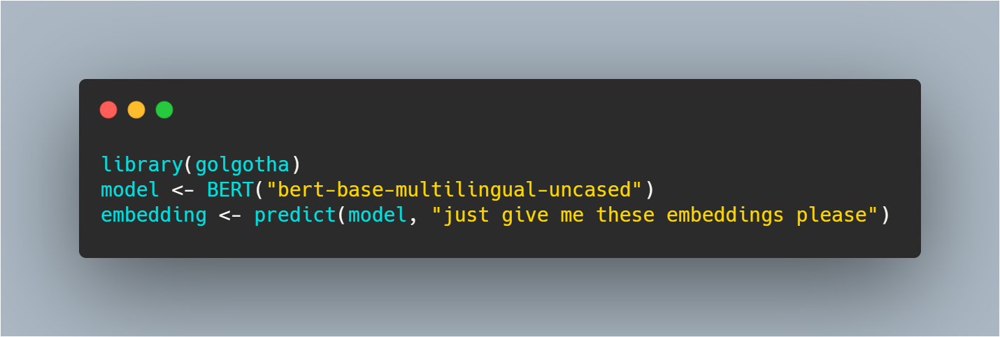

# golgotha - Contextualised Embeddings and Language Modelling using BERT and Friends using R

- This R package wraps the transformers module using reticulate
- The objective of the package is to get easily sentence embeddings using a BERT-like model in R
  For using in downstream modelling (e.g. Support Vector Machines / Sentiment Labelling / Classification / Regression / POS tagging / Lemmatisation / Text Similarities)
- Golgotha: Hope for lonely AI pelgrims on their way to losing CPU power: http://costes.org/cdbm20.mp3



## Installation

- For installing the development version of this package: 
    - Execute in R: `devtools::install_github("bnosac/golgotha", INSTALL_opts = "--no-multiarch")`
    - Look to the documentation of the functions: `help(package = "golgotha")`

## Example

- Download a model (e.g. bert multilingual lowercased) 

```{r}
library(golgotha)
bert_download_model("bert-base-multilingual-uncased")
```

- Load the model and get the embedding of sentences / subword tokens or just tokenise

```{r}
model <- BERT("bert-base-multilingual-uncased")
x <- data.frame(doc_id = c("doc_1", "doc_2"),
                text = c("give me back my money or i'll call the police.",
                         "talk to the hand because the face don't want to hear it any more."),
                stringsAsFactors = FALSE)
embedding <- predict(model, x, type = "embed-sentence")
embedding <- predict(model, x, type = "embed-token")
tokens    <- predict(model, x, type = "tokenise")
```

- Same example but now on Dutch / French

```{r}
text <- c("vlieg met me mee naar de horizon want ik hou alleen van jou",
          "l'amour n'est qu'un enfant de pute, il agite le bonheur mais il laisse le malheur",
          "http://costes.org/cdso01.mp3", 
          "http://costes.org/mp3.htm")
text <- setNames(text, c("doc_nl", "doc_fr", "le petit boudin", "thebible"))
embedding <- predict(model, text, type = "embed-sentence")
embedding <- predict(model, text, type = "embed-token")
tokens    <- predict(model, text, type = "tokenise")
```

- Some other models

```{r}
model <- BERT("bert-base-multilingual-uncased")
model <- BERT("bert-base-multilingual-cased")
model <- BERT("bert-base-dutch-cased")
model <- BERT("bert-base-uncased")
model <- BERT("bert-base-cased")
model <- BERT("bert-base-chinese")
```
